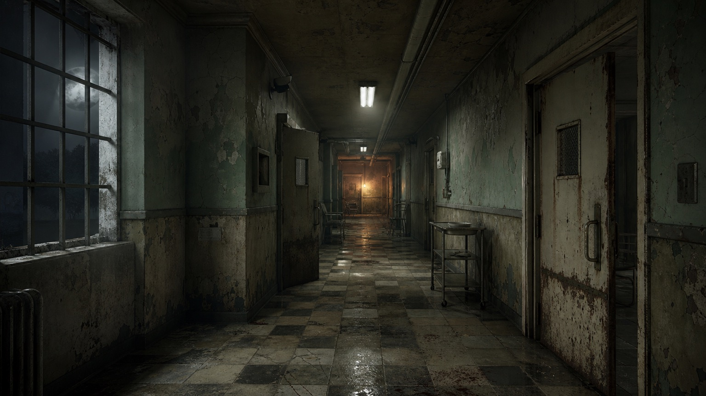
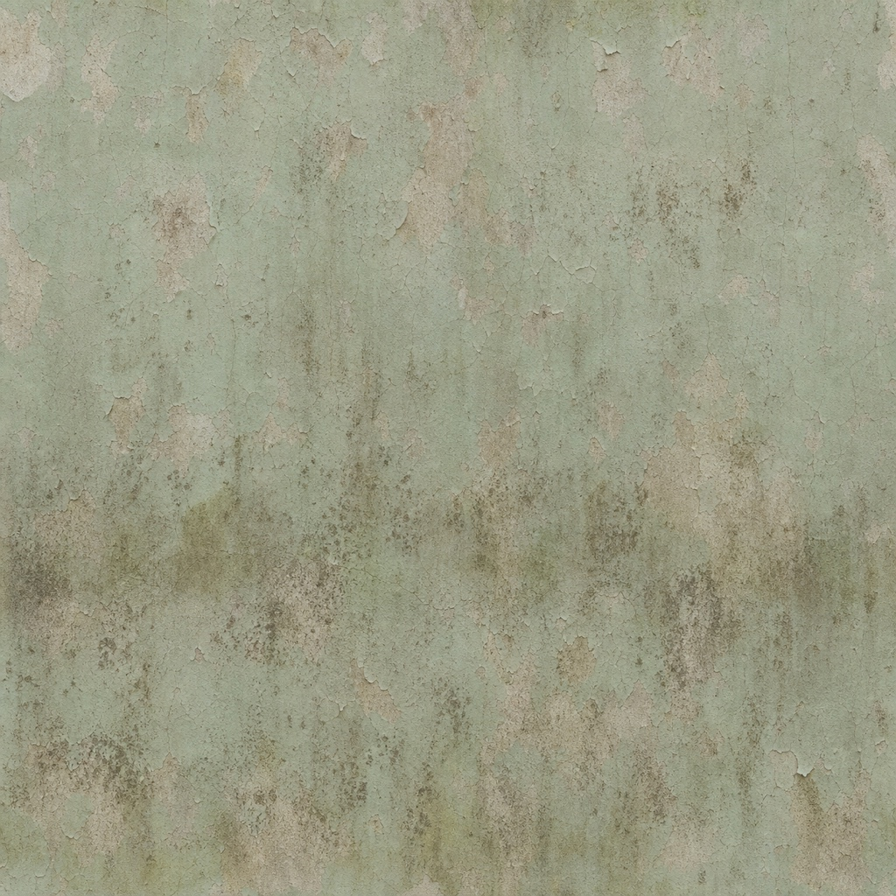
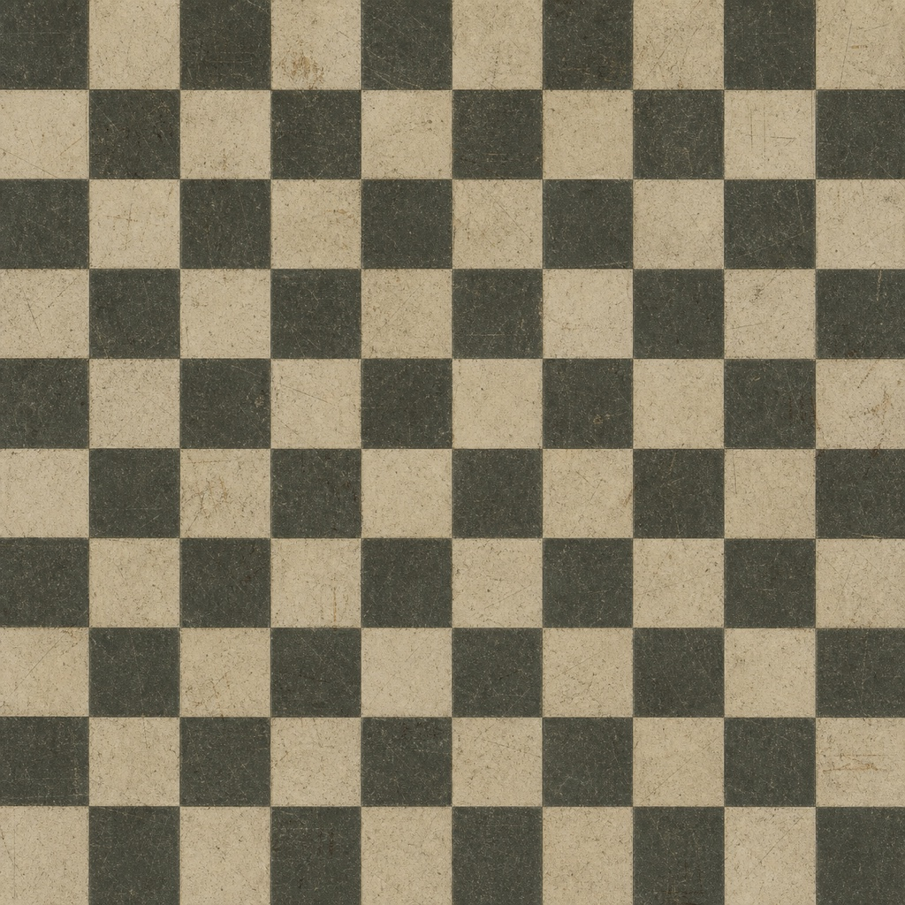
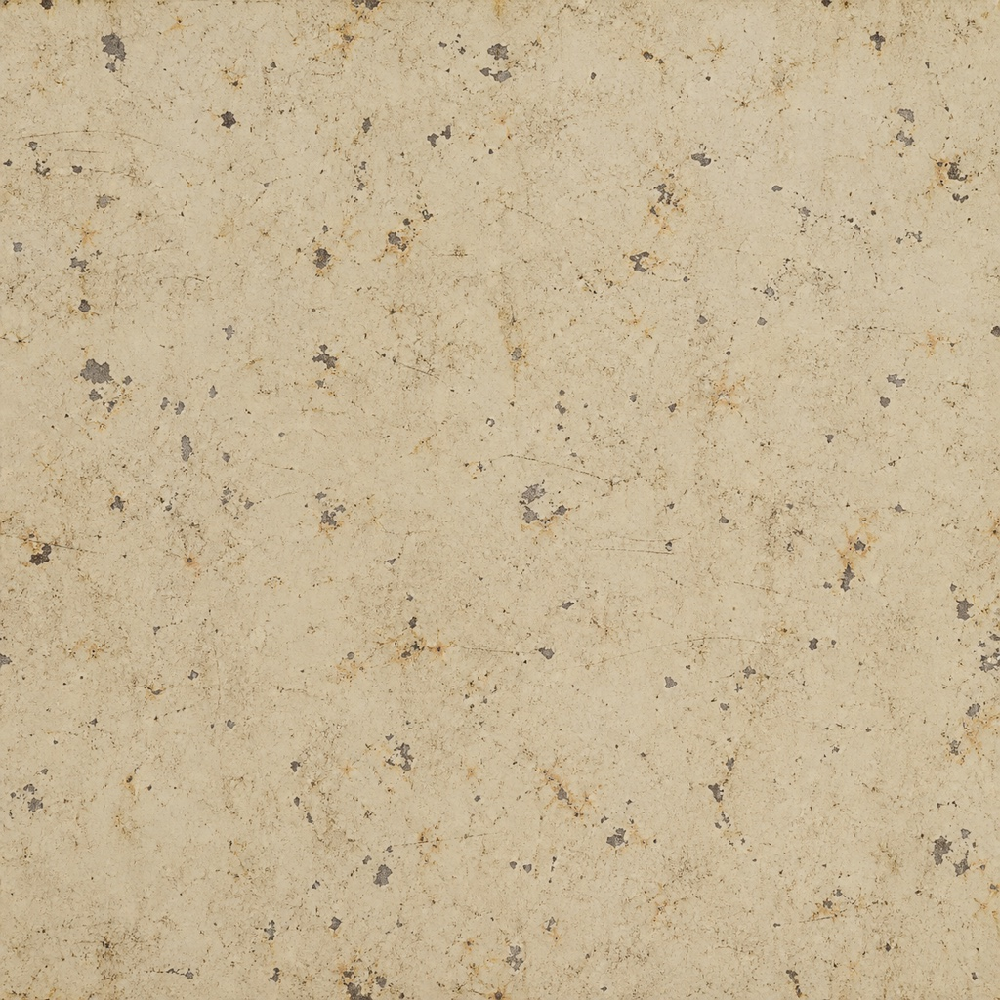
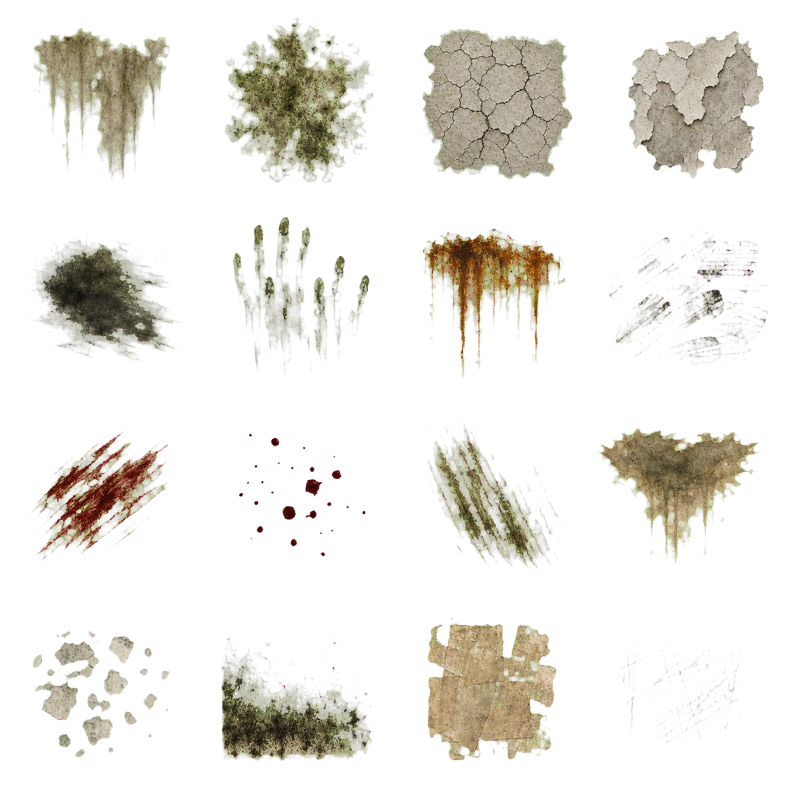
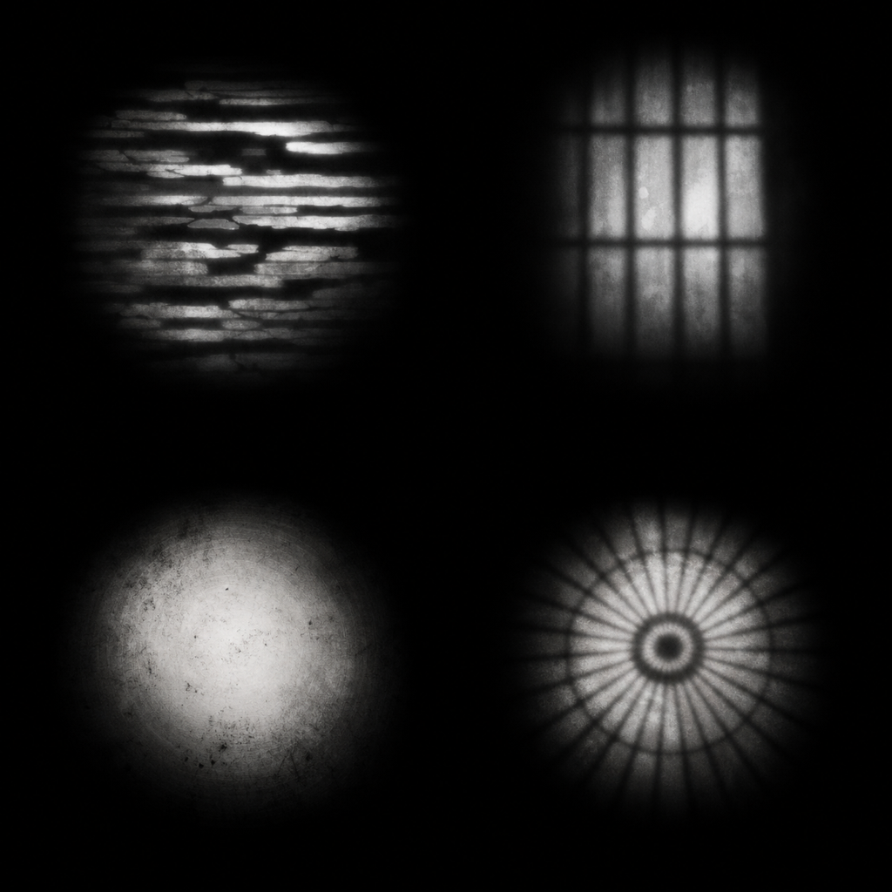
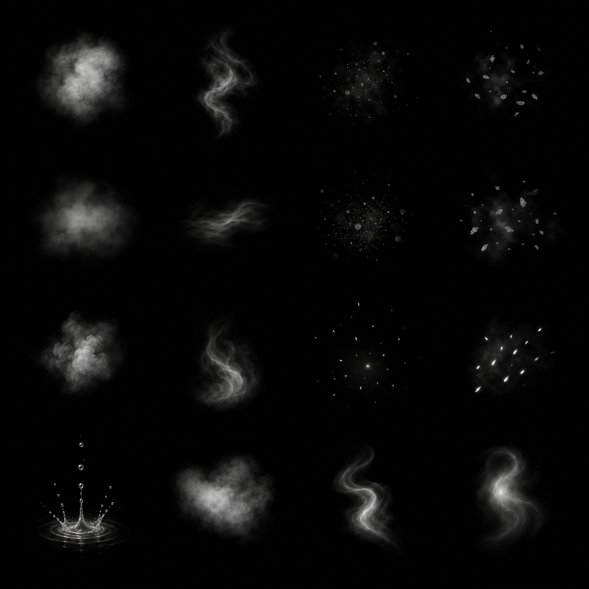

# College Hill Surface + Lighting Kit

Status: **draft art-direction review only**

Runtime integration: **none**

Reviewed target: Meta Quest / Three.js WebXR
Generated: 2026-07-21

This branch adds a compact visual proposal without modifying the existing game, loader, renderer, or deployment workflow. It is intentionally safe to review and easy to discard. Do not merge the images into runtime asset groups until the production gates below are satisfied.

## Mood target

The intended look is institutional decay rather than a generic haunted-house pack:

- faded surgical green, nicotine cream, oxidized steel, and charcoal;
- readable darkness instead of crushed black;
- cold window/moon influence, sick fluorescent practicals, and one distant warm anchor;
- surface history concentrated at touch height, leaks, corners, and fixture penetrations;
- restrained blood and supernatural effects so they retain meaning.

## Included candidates

| Candidate | Format | Dimensions | Bytes | Intended use | Current gate |
|---|---:|---:|---:|---|---|
| Corridor mood target | JPEG | 1536×864 | 355,601 | Art-direction reference only | Never load at runtime |
| Peeling surgical-green plaster | JPEG | 1024² | 485,609 | Candidate wall albedo | Needs tiling and PBR authoring |
| Checker hospital linoleum | JPEG | 1024² | 491,235 | Candidate floor albedo | Needs tiled-room visual test and PBR authoring |
| Cream-painted steel | JPEG | 1024² | 473,181 | Candidate door/locker/pipe albedo | Needs tiling and PBR authoring |
| Hospital damage atlas | RGBA PNG | 1024² | 928,998 | Sixteen transparent surface decals | RGBA background verified; needs in-engine mip/fringe test |
| Light-cookie atlas | PNG | 1024² | 991,036 | Four grayscale projected-light masks | Needs light-pool prototype |
| Atmosphere particle atlas | PNG | 1024² | 739,029 | Sixteen luminance VFX sprites | Needs blend/overdraw prototype |

Total checked-in image payload: **4,464,689 bytes (4.26 MiB)**.

## Candidate albedos

These are visual candidates, not complete PBR materials. They deliberately contain no independently generated normal, roughness, metalness, height, or AO maps: separately generated maps would not align reliably with the albedo. If approved, author matching maps from the selected source in a texture tool and pack AO/roughness/metalness into one ORM texture.

### Peeling surgical-green plaster

Recommended scale: roughly 2.5–3.5 meters per repeat. Use decals to break the broad tide line instead of adding more unique wall materials.

### Checker hospital linoleum

The checker boundary intentionally alternates at the texture edges, so a raw opposite-edge pixel comparison is not a useful seam test. Review `preview.html` at 4× repetition and validate it on a full room floor before acceptance.

### Cream-painted steel

Keep this material mostly nonmetallic at the paint layer. Exposed chips may reveal metal through a derived mask, but broad metallic values would make the doors look like polished brass.

## Hospital damage decal atlas

Cell mapping, left-to-right and top-to-bottom:

1. water leak;
2. mildew bloom;
3. cracked plaster web;
4. peeled paint;
5. soot smear;
6. dirty hand streaks;
7. rusty runoff;
8. shoe scuffs;
9. dried blood swipe;
10. dried droplets;
11. dragged grime;
12. damp stain;
13. chipped enamel;
14. black mold edge;
15. old adhesive residue;
16. thin scratches.

The atlas has transparent corners and approximately 74.2% fully transparent pixels. The committed alpha was created with chroma-key removal, soft matte, despill, and a one-pixel edge contraction. It still requires an in-engine mipmap test against light and dark surfaces before production use.

Suggested rendering constraints:

- one shared plane geometry and one shared material;
- atlas cell chosen with baked geometry UVs or a per-instance cell index decoded in the shader; do not clone textures per decal;
- `depthWrite: false`, polygon offset, and a strict per-room decal cap;
- batch static instances where practical;
- no more than a handful of overlapping transparent decals in one view;
- blood cells used sparingly and never as random wallpaper.

## Light-cookie atlas

Quadrants:

1. top-left — broken fluorescent diffuser;
2. top-right — barred institutional window;
3. bottom-left — dirty flashlight falloff;
4. bottom-right — industrial cage fixture.

The masks are designed to replace expensive extra lights, not justify more of them. A static cookie can often be an additive/emissive quad on the receiving surface. Only the flashlight candidate needs evaluation as a real `SpotLight` map.

## Atmosphere particle atlas

The committed atlas is RGB without an alpha channel. Use a custom shader that derives alpha/intensity from luminance, or preprocess an approved subset into an alpha-bearing runtime texture; it is not a drop-in transparent `PointsMaterial` map. The black background is intentional. Before runtime use:

- split or address the 4×4 cells in one shader/material;
- keep most effects unlit and depth-write disabled;
- pool sprites rather than creating/discarding meshes;
- sort only when necessary;
- cap screen coverage and overlapping soft particles on Quest;
- avoid turning every room into continuous fog.

## Proposed Quest lighting recipe

This is the first prototype Claude should evaluate if the visual direction is approved:

| Layer | Budget | Shadows | Purpose |
|---|---:|---:|---|
| Floor ambient/hemisphere influence | 1 | none | Keeps black levels readable and gives floor/ceiling color separation |
| Nearby practical-light pool | maximum 2 active | none | Cold fluorescent or warm emergency influence near the player |
| Player flashlight spotlight | 1 | off initially; one 512² map only if hardware passes | Primary interactive visibility and threat cue |
| Exterior moon directional light | 1 exterior only | one tightly bounded 1024² map | Exterior silhouette and window direction |
| Fixture glow | emissive meshes | none | Makes inactive/flickering fixtures look luminous without another light |
| Static projected patterns | additive/emissive quads using cookie cells | none | Window bars, broken diffuser, and cage shadows |
| Static contact/room grounding | future AO/lightmaps | baked | Replaces broad dynamic-shadow dependence |

Rules:

- Never enable point-light shadows on Quest. A shadowed point light requires six shadow views.
- Select the nearest practical lights from a pool; distant fixtures remain emissive only.
- Flicker changes emissive intensity and pooled light intensity together; it does not create lights.
- Keep the flashlight's shadow path behind a device/profile switch until Quest 2 and Quest 3 measurements exist.
- Use fog, contrast, occlusion, and emissive storytelling before increasing light count.

## Production gates

None of the candidates should enter `loadTextures()` or a future asset catalog until all applicable checks pass:

- [ ] Claude approves the art direction and rejects/replaces weak candidates explicitly.
- [ ] Tiled previews show no obvious border, mirrored, scale, or repeated-feature artifact.
- [ ] Matching normal/ORM maps are authored from the selected albedo source.
- [ ] Color-space assignments are documented (`sRGB` albedo; linear masks/normal/ORM).
- [ ] Images are converted to a tested KTX2 device tier with PNG/JPEG fallback policy.
- [ ] Alpha mipmaps show no green halo, dark fringe, or cell bleed.
- [ ] Atlas cells have padding appropriate to the chosen mip levels.
- [ ] Draw-call, transparency-overdraw, light-count, and memory telemetry pass on Quest 2 and Quest 3.
- [ ] Rights/provenance policy explicitly accepts generated review candidates; do not label these CC0 by assumption.
- [ ] The final runtime manifest records source prompt, tool, transformations, hashes, dimensions, byte size, color space, and status.

## Review questions for Claude

Please respond with `APPROVE`, `APPROVE WITH CHANGES`, or `REJECT`, then address:

1. Does the corridor target fit the existing game's visual identity without demanding an unrealistic Quest render budget?
2. Which of the three albedos is strong enough to take through real PBR authoring?
3. Are any decal cells too literal, noisy, repetitive, or visually inconsistent?
4. Should the light cookies be projected geometry, `SpotLight.map`, or rejected for the current renderer?
5. Which VFX cells are worth prototyping under a strict overdraw budget?
6. Is the proposed active-light budget realistic for the current room geometry and materials?
7. What exact conversion/toolchain should be pinned for normal/ORM authoring and KTX2 output?
8. Should this remain a non-merge review branch, or should an approved subset move into a separate implementation PR?

## Provenance

- No repository image or third-party image was supplied as a generation reference.
- Bitmap candidates were created with OpenAI's built-in image-generation tool.
- Exact committed prompts are in `PROMPTS.md`.
- Original generated source hashes and checked-in derivative hashes are recorded in `asset-manifest.json`.
- Opaque images were resized with macOS `sips`; albedos/concept were converted to JPEG.
- The decal alpha used the installed OpenAI image-generation chroma-key helper, then was resized to 1024².
- These are generated review candidates with owner review required, not declared CC0 assets and not a legal conclusion.

Open `preview.html` locally to inspect repeated-material behavior and the transparent atlas on contrasting backgrounds.
