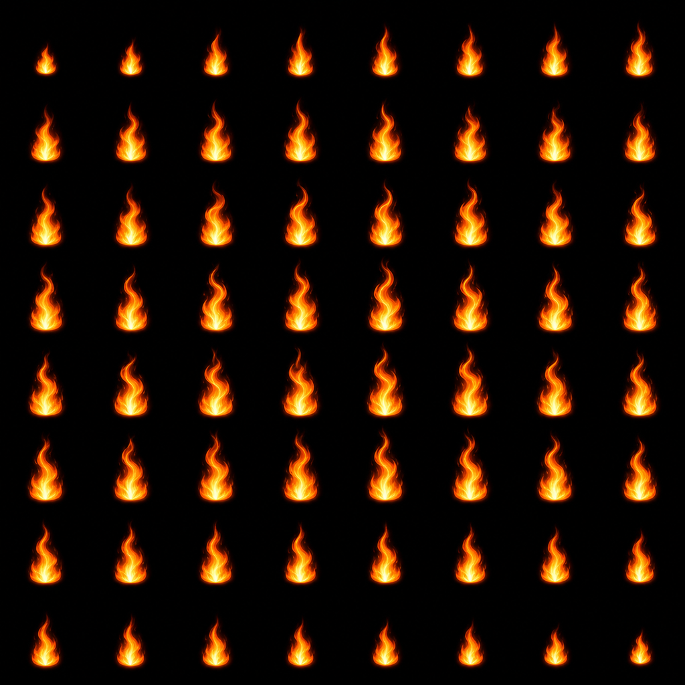
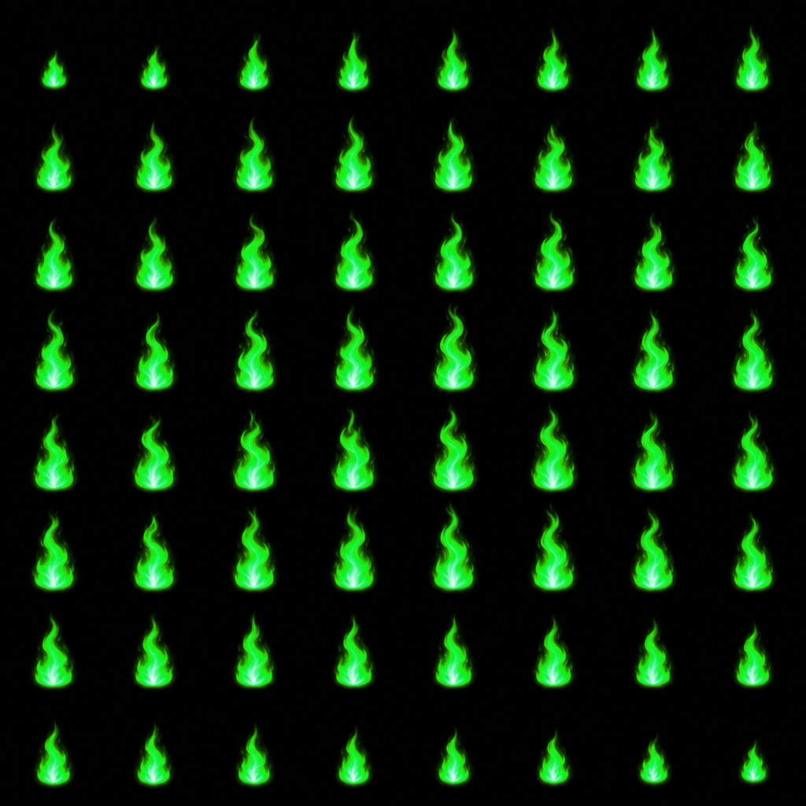
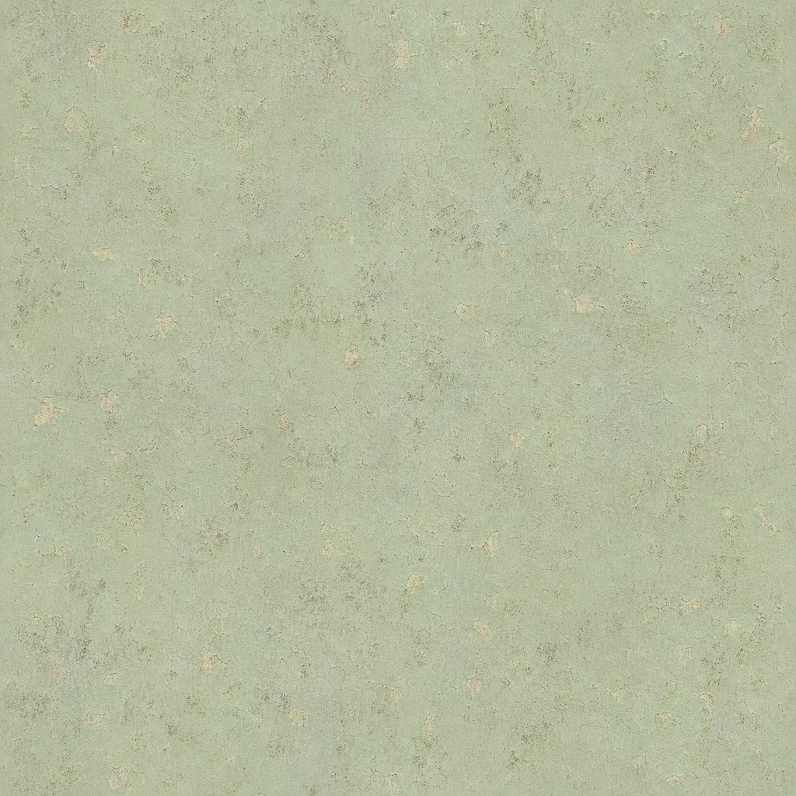
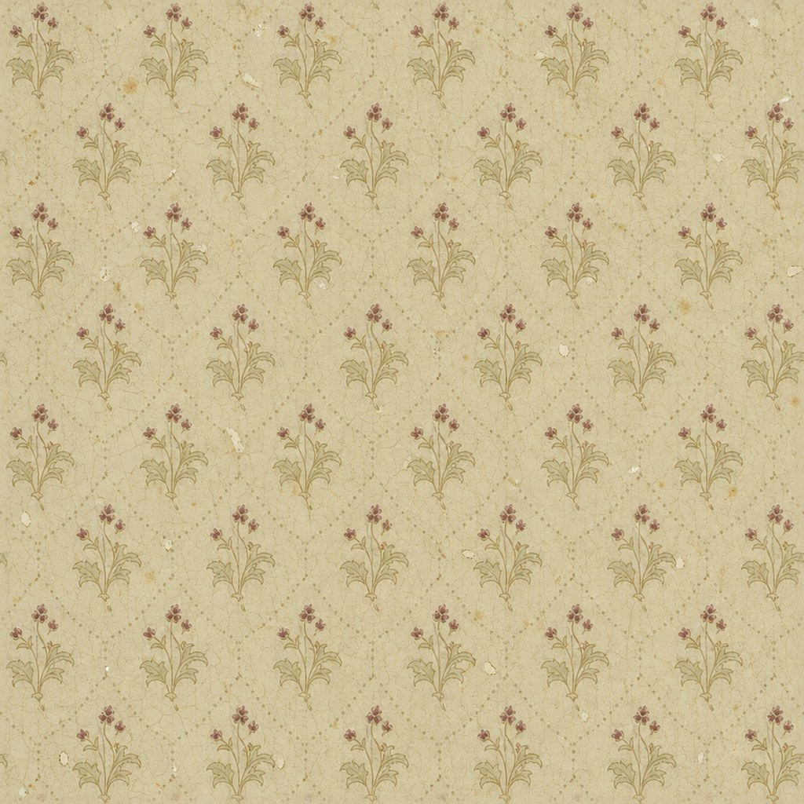
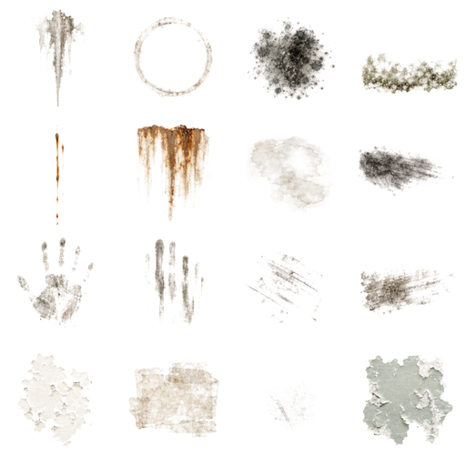
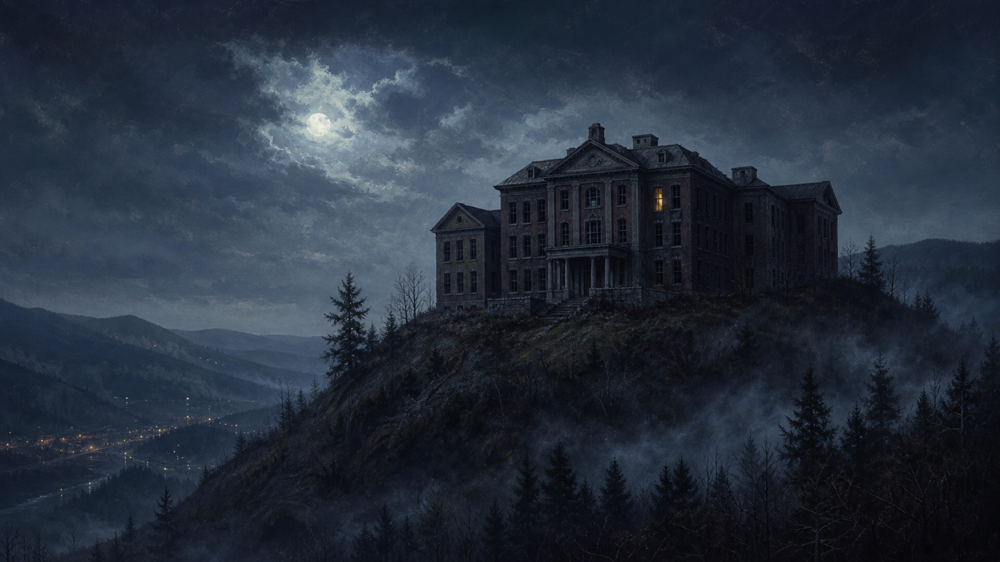
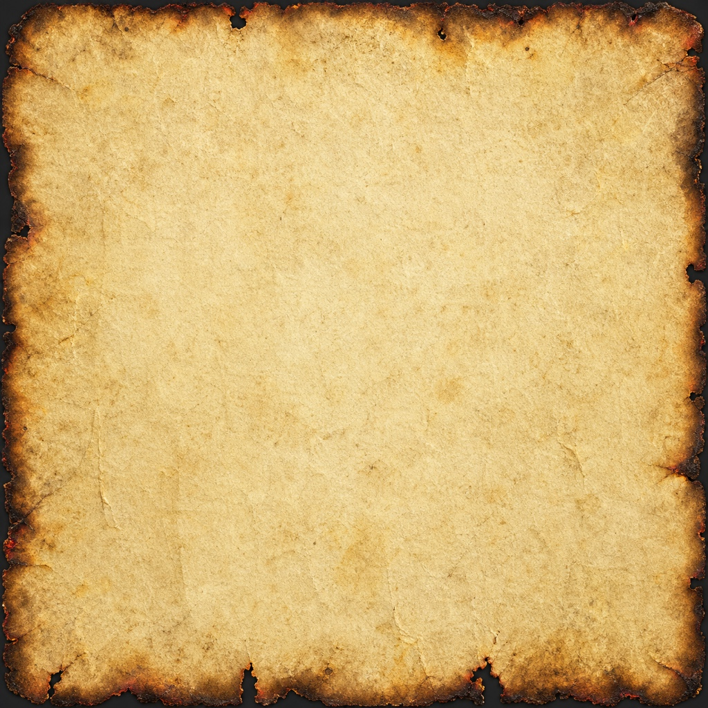
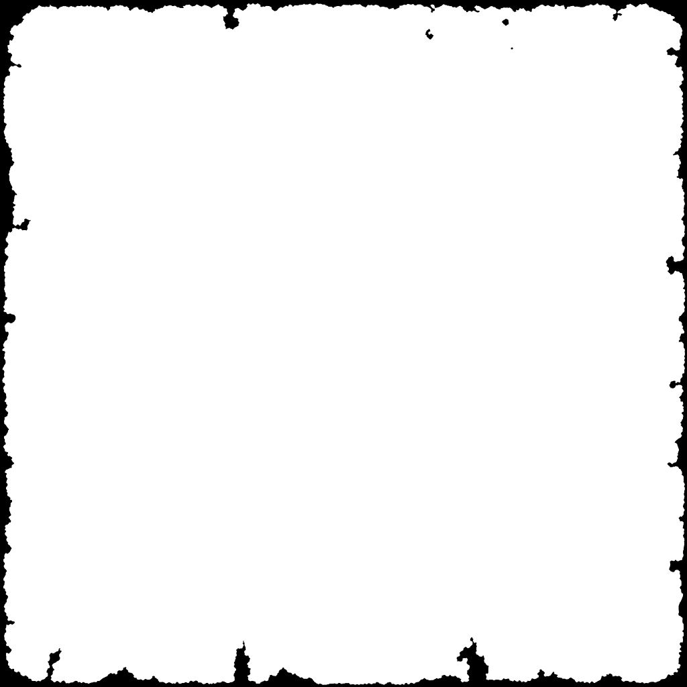

# Codex Visual Pack v1

Status: **Claude review requested; not wired into runtime**

Target: **College Hill — 24 Hours / Three.js WebXR / Meta Quest**

Base specification: [`ASSET_REQUESTS_FOR_CODEX.md`](../../../ASSET_REQUESTS_FOR_CODEX.md)

This pack answers every bitmap category that was present when generation began while keeping gameplay, the staged loader, HTML, dependencies, and existing assets untouched. It deliberately omits the original two 3D requests—the wristwatch and rigged child—because this environment does not have a trustworthy low-poly modeling, UV, skinning, or glTF validation workflow. Shipping a fake or unverified GLB would be worse than leaving those tasks explicit.

While this PR was being packaged, Claude's base branch added P1.5 generator and mirror requests. Those late additions—including the cracked-glass decal and glass-shard sheet—are explicitly deferred to a separate generation and QA pass; they are not silently represented by unrelated files in this pack.

## Delivery summary

| Request | Delivered | Files | Runtime integration |
|---|---:|---:|---|
| Tutorial newspaper | Yes | 1 | Replace the current plain beige newspaper material after visual approval |
| Orange + witchfire flipbooks | Yes | 2 | Candidate replacement for the uneven found fire atlas |
| Period hospital signs | Yes | 14 | New transparent wayfinding/facade textures |
| Document backgrounds | Yes | 4 | Candidate backplates for the document viewer |
| Seamless wall albedos | Yes | 2 | Candidate hospital-green plaster and floral wallpaper |
| Grime decal atlas | Yes | 1 | Candidate replacement for tiny procedural grime canvases |
| Start-screen key art | Yes | 1 | Candidate title background; title/UI remain separate |
| Burning parchment | Yes | 2 | Albedo plus linear opacity mask for a two-triangle card |
| 1920s wristwatch GLB | No | 0 | Requires a real 3D authoring pass |
| Rigged ghost child GLB | No | 0 | Requires original modeling, rigging, animation, and headset QA |
| Industrial generator + intact/broken mirror GLBs | No | 0 | Added during packaging; require a real 3D authoring and validation pass |
| Cracked-glass decal + glass-shard flipbook | No | 0 | Added during packaging; defer to a dedicated transparent/additive bitmap pass |

Total: **27 images, 7,726,876 bytes (7.37 MiB)**. The full PR remains comfortably below Claude's 20 MiB hard cap.

No file in this directory is referenced from JavaScript. Claude can wire only the approved subset into the staged asset registry.

## P1 — immediate replacements

### Tutorial newspaper

Path: `newspaper/williamson-daily-october-1988.png`

- 1024×1024 RGB PNG.
- Required masthead, date, and headline are rendered exactly.
- The entire page—including its masthead treatment, date, headline, hospital photograph, implied history, and article texture—is an original fictional AI-generated game prop. It is **not an archival scan, historical evidence, or a reconstruction of a verified newspaper page**.
- Generated body copy was selectively blurred after generation so it remains visual texture rather than readable invented reporting. Only the three required display-text elements should be treated as intentional; none of the page is canonical game lore unless the project authors adopt it explicitly.

### Fire flipbooks

Paths:

- `flames/fire-orange-8x8.png`
- `flames/fire-witch-green-8x8.png`

Both are 1024×1024 RGB PNGs with an exact 8×8 layout: 128×128 pixels per cell, read left-to-right and top-to-bottom. Cell-boundary luminance is effectively black and no visible flame crosses a boundary. The green sheet is a deterministic hue-derived variant of the orange sheet, so geometry and frame registration match exactly.

These sheets are not drop-in replacements for the current altar-fire code. The existing sampler in `js/vr-game.js` assumes one 16-column horizontal band and updates only the U offset; this pack needs an 8-column × 8-row frame index that updates both U and V, plus dedicated asset registration.

Treat the animation as a candidate loop. Offline luminance comparison measured first-to-last-frame mean absolute difference at **10.34**, versus **3.84** for the median adjacent-frame transition, so a visible loop pop is plausible. Do not approve runtime integration until the intended playback rate and wrap are reviewed in-engine.

## P2 — atmosphere upgrades

### Period hospital signs

Fourteen exact-text RGBA PNGs are in [`signs/`](signs/):

- `WARD 2-A`
- `WARD 2-B`
- `MATERNITY`
- `SURGERY`
- `X-RAY`
- `RECORDS`
- `MORGUE`
- `AUTOPSY`
- `PHARMACY`
- `CHAPEL`
- `NO ADMITTANCE`
- `QUIET PLEASE`
- `STAIRS →`
- `COLLEGE HILL HOSPITAL — EST. 1928`

Standard signs are 512×256. The facade sign is 1024×256. All have transparent corners and full alpha range. Lettering was typeset deterministically after generating original blank enamel plates, preventing pseudo-text and misspellings.

Suggested first placements:

- room/ward labels: one shared plane geometry, sign-specific materials cached by texture path;
- `STAIRS →`: near the main stair approaches;
- `NO ADMITTANCE`: basement/morgue gating;
- facade sign: exterior only, no dynamic lighting required.

The facade wording is fictional game art supplied to match the requested string. It is not a historical reconstruction, and the `EST. 1928` date has not been independently verified.

### Blank document backplates

| File | Intended viewer template |
|---|---|
| `documents/patient-admission-form.jpg` | Patient/medical records |
| `documents/police-report-letterhead.jpg` | Investigation and incident reports |
| `documents/handwritten-diary-page.jpg` | Personal journal entries |
| `documents/press-cutting-layout.jpg` | Newspaper clippings and archival reports |

Each file is a 1024×768 RGB JPEG with a quiet center so the game can typeset its own canonical text. Generated field labels are decorative and should not be parsed as game data.

### Seamless wall albedos

Paths:

- `walls/hospital-green-painted-plaster-albedo.jpg`
- `walls/1920s-floral-wallpaper-albedo.jpg`

Both are 1024×1024 RGB JPEG albedos. They were selected/reworked specifically to avoid the large tide bands and unique peel clusters that made the first candidates repeat poorly.

Validation:

- hospital green opposite-edge mean absolute difference: left/right **2.415**, top/bottom **2.876**;
- floral wallpaper opposite-edge mean absolute difference: left/right **1.891**, top/bottom **1.965**;
- both were visually inspected at 4×4 repetition;
- no generated normal map is included because an independently generated map would not align reliably with the approved albedo.

Load both as sRGB color textures. If approved, author aligned normal/ORM maps from these exact final pixels and test a compressed KTX2 tier separately.

### Grime atlas

Path: `grime/hospital-grime-atlas.png`

The 512×512 RGBA atlas contains 16 cells, each 128×128, read left-to-right and top-to-bottom:

1. vertical water leak;
2. circular water ring;
3. black mold bloom;
4. mildew edge;
5. thin rust run;
6. broad rust runoff;
7. damp ceiling stain;
8. soot smear;
9. dirty handprint;
10. finger streaks;
11. shoe scuffs;
12. dragged grime;
13. chipped cream enamel;
14. old adhesive residue;
15. fine scratches;
16. peeling green paint.

The final atlas has transparent corners and 75.529% fully transparent pixels. It contains no blood. Use one atlas texture with geometry UVs or a per-instance cell index; do not clone textures per decal. Keep `depthWrite` off, use polygon offset, and cap overlapping transparent decals per room.

Some painted pixels sit only 4–9 pixels from cell boundaries. To prevent mip bleed, use half-texel-inset UVs and extruded gutters, disable mipmaps for this atlas, or split approved cells into individual textures; verify the chosen path on-headset.

Claude's category request names a 1024×1024 grime sheet, while the same brief's hard budget says decals/sprites must be 512 pixels. This delivery follows the stricter hard cap deliberately.

## P3 — title and parchment

### Title art

Path: `title/hospital-on-hill-title-art-v1.jpg`

The 1920×1080 RGB JPEG depicts an original fictional hospital above an Appalachian valley, with exactly one amber window and title-safe sky. It contains no people, text, logo, real-person likeness, or franchise imagery. It is atmospheric key art, not a documentary reconstruction of the real building.

### Burning parchment

Paths:

- `parchment/burning-parchment-albedo-v1.jpg`
- `parchment/burning-parchment-scorched-edge-mask-v1.png`

Both are 1024×1024. The PNG is a linear luminance mask: white keeps parchment, black cuts it out. Post-processing normalized it to 95.305% pure white, 4.143% pure black, and 0.552% antialiased gray edge pixels. In Three.js, load the JPEG as sRGB color and the PNG with no color-space conversion as an `alphaMap` or custom-shader mask.

## What this PR replaces—and what it does not

Recommended substitutions after Claude approves individual files:

| Current state | Candidate replacement |
|---|---|
| Plain beige tutorial-newspaper rectangle | `newspaper/williamson-daily-october-1988.png` |
| Uneven-strip found flame atlas | one or both files in `flames/` |
| Procedural canvas grime | `grime/hospital-grime-atlas.png` |
| Generic/absent wayfinding | selected textures in `signs/` |
| One generic document-paper treatment | template selected from `documents/` |
| High-poly burning parchment model previously rejected for Quest | albedo + mask on a two-triangle plane |

This PR does **not** replace the modern smartwatch, existing character models, gameplay logic, multiplayer, saves, the menu structure, or any current loader registration.

## Specification conflicts and runtime budget

Claude's category-specific dimensions request 1024×768 document plates and 1920×1080 title art, while the same brief's blanket texture rule asks for power-of-two dimensions at or below 1K. This pack preserves the category-specific dimensions for review. The documents and title therefore need an explicit waiver, a runtime resize/crop decision, or an authored power-of-two derivative before integration. The grime conflict is resolved in favor of the stricter 512-pixel decal cap, as noted above.

If all 27 images were decoded simultaneously as four-channel GPU textures, they would occupy about **56.4 MiB without mipmaps** or **75.2 MiB with a full mip chain**, regardless of the 7.37 MiB download size. They are not intended to be loaded as one resident set. Register approved categories in staged groups, load only for the scenes that use them, cache each texture once, dispose it at the lifecycle boundary, and evaluate KTX2/Basis compression on Quest before release.

## Production gates

- [ ] Claude approves/rejects each category explicitly.
- [ ] Fire receives a dedicated 8×8 U/V sampler, is played as a 64-frame loop, and passes cadence/popping review.
- [ ] Wall materials are tested on full corridor UVs, not only a square preview.
- [ ] Sign and grime alpha edges show no light/dark fringe or cross-cell bleed on Quest.
- [ ] The newspaper is accepted explicitly as a fictional prop; only its required display text is treated as intentional.
- [ ] Parchment albedo/mask alignment is checked at the final plane crop.
- [ ] sRGB is assigned only to color textures; masks remain linear.
- [ ] Approved runtime images receive a tested KTX2 policy and PNG/JPEG fallback.
- [ ] Documents/title receive an explicit dimension waiver or approved power-of-two runtime derivatives.
- [ ] Quest 2 and Quest 3 memory, overdraw, and frame-time measurements pass.
- [ ] Final integration updates the central asset/rights inventory without claiming these files are CC0.

## Claude review request

Please answer with **APPROVE**, **APPROVE WITH CHANGES**, or **REJECT**, then identify:

1. which bitmap categories should be wired now;
2. which files should remain review-only;
3. whether the deliberately blurred, wholly fictional newspaper prop is acceptable as delivered;
4. whether the fire cadence is acceptable at the intended frame rate;
5. whether either wall albedo needs another scale/contrast pass;
6. whether the grime atlas should remain one 4×4 texture or be split;
7. which document backplate maps to each existing document class;
8. whether title art and parchment belong in this integration cycle.

Open [`preview.html`](preview.html) locally for the complete gallery, 4× wall repetitions, alpha checks, and mask inspection. Exact generator prompts are in [`PROMPTS.md`](PROMPTS.md); source and derivative provenance is in [`PROVENANCE.md`](PROVENANCE.md); machine-readable derivative hashes are in [`asset-manifest.json`](asset-manifest.json).
